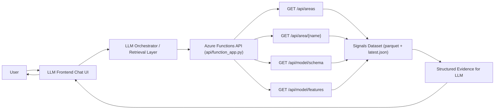
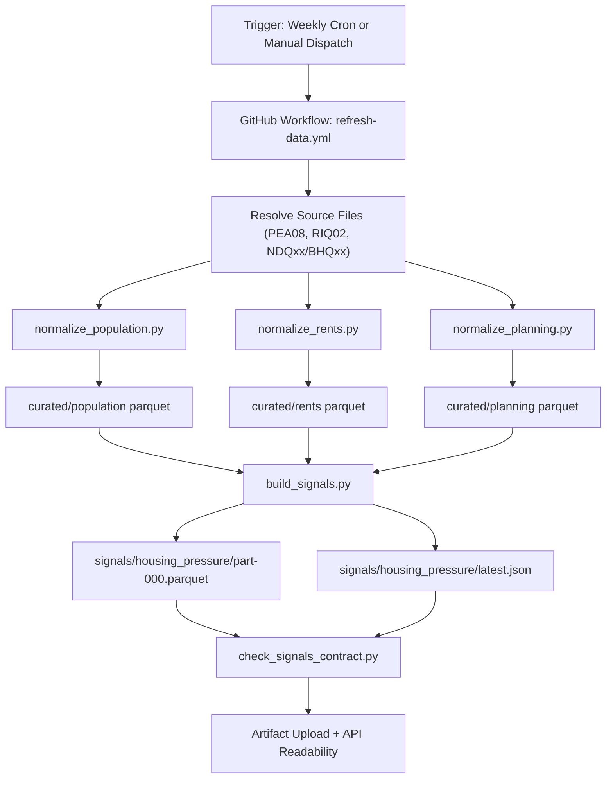

# LLM Query Architecture And Data Refresh Pipeline

## 1) LLM Querying Generated Scores (Runtime Architecture)

### Runtime intent

- ETL computes scores once; LLM does retrieval and explanation only.
- API is the stable contract between scored data and LLM interaction.
- LLM should answer using retrieved fields (`overall score`, `classification`, `driver`, `rank`, `percentile`, trend features).

## 2) Data Refresh + Scoring Pipeline (Batch Architecture)

### Refresh intent

- Normalize raw files into consistent county-level curated tables.
- Build deterministic component scores and composite score.
- Publish both machine-friendly parquet and LLM-friendly JSON.
- Validate schema/range/coverage before downstream usage.
